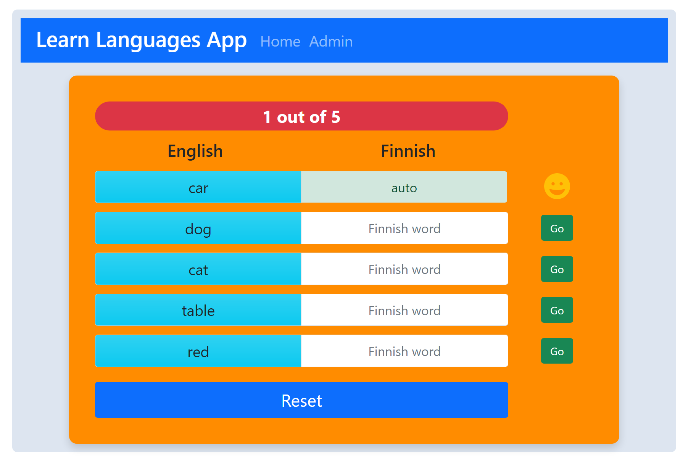
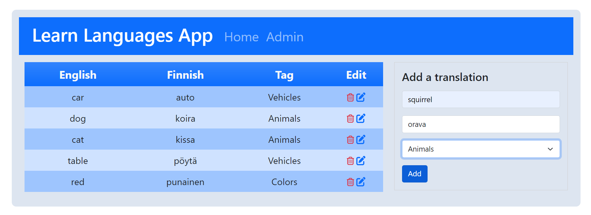
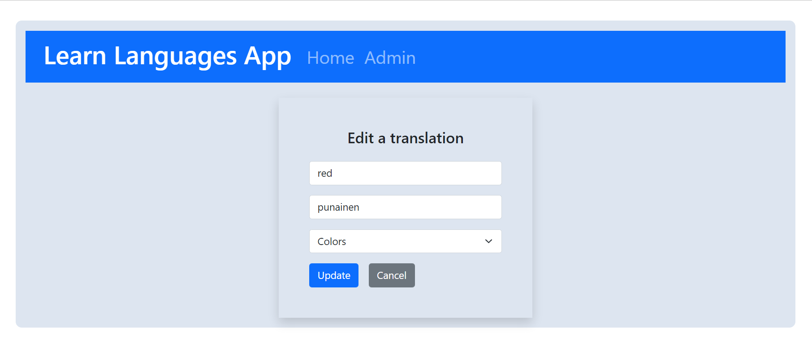

# learn-languages-app

A foreign language vocabulary training app for kids.

## Author

Roger Graham 

## Demo Website

https://nordicirish-learn-languages.herokuapp.com/

## Youtube video

https://www.youtube.com/watch?v=uH4uRBqRCjE

## Screenshots

### Game screen

### Admin screen

### Edit screen

## How to use

Use the admin screen to add, edit and delete English words and their corresponding Finnish translations.

The translations are displayed on the homepage form. The user then attempts to input the correct translation and the game gives them feedback on their progress.

## Requirements

`Node.js`

`MySQL / MariaDB`

`React`

## Install

### Database

Create database tables and add some translation information and word categories.

`CREATE TABLE translations(id INT(11) NOT NULL PRIMARY KEY AUTO_INCREMENT,`
`english VARCHAR(255) UNIQUE NOT NULL,`
`finnish VARCHAR(255) UNIQUE NOT NULL,`
`tag_id VARCHAR(255),`
`FOREIGN KEY(tag_id) REFERENCES tags(tag) ON UPDATE CASCADE ON DELETE RESTRICT`
`);`

`CREATE TABLE tags(tag VARCHAR(255) UNIQUE NOT NULL PRIMARY KEY);`

`INSERT INTO tags (tag)`
`VALUES`
`("Colors"),`
`("Vehicles"),`
`("Animals"),`
`("Furniture"),`
`("Plants");`

`INSERT INTO translations (english, finnish, tag_id)`
`VALUES`
`("red", "punainen", "Colors"),`
`("car", "auto", "Vehicles"),`
`("dog", "koira", "Animals"),`
`("cat", "kissa", "Animals"),`
`("table", "pöytä", "Furniture"),`
`("birch", "koivu", "Plants");`

### Application

clone the code to your computer

`git clone https://github.com/nordicirish/learn-languages-app`

### 1 Install the backend

In the root of the project:

`npm install`

Rename env file to .env and fill your database credentials:

`db_server =`

`user =`

`password =`

`db =`

### 2 Install React frontend

`cd frontend`

`npm install`

`npm run build`

`npm run start`

## Credits

### My lecturers at Tampere University of Applied Sciences for their great knowledge, teaching and motivation

Jussi Pohjolainen

Jari Aalto

Sami Kojo-Fry

Teemu Heinimäki

Pekka Yliruusi

### Other Credits

Various React tutorials from Chris Blakely:
https://www.freecodecamp.org/news/author/chris

Dev Ed's YouTube channel
https://www.youtube.com/c/DevEd

A cast of thousands on stackoverflow :) https://stackoverflow.com/

## Planned Future Development

## Game Screen

- Filtering by tag
- Randomization of the game items
- Limit to the number items rendered in the game
- Users can select the range of numbers the game uses
- Add Feedback sounds

## Admin Screen

- Edit screen to become a modal or possibly introduce inline editing and deletion
- Add tag creation, updating and deletion
- Support for additional languages
